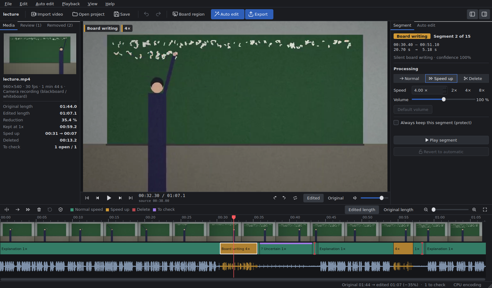
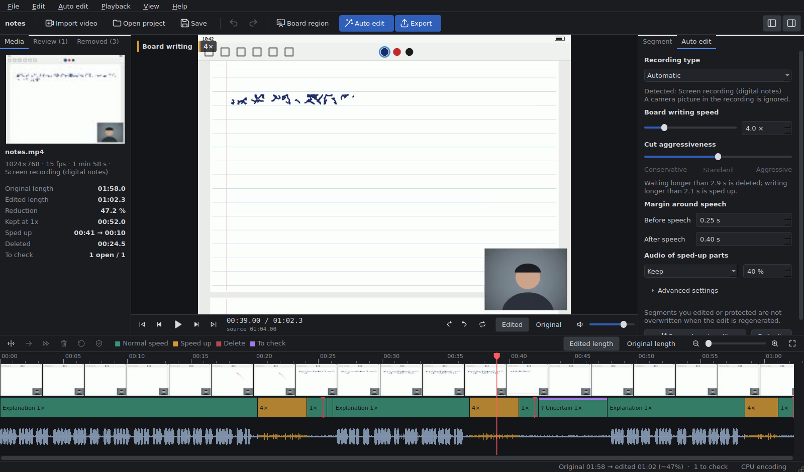
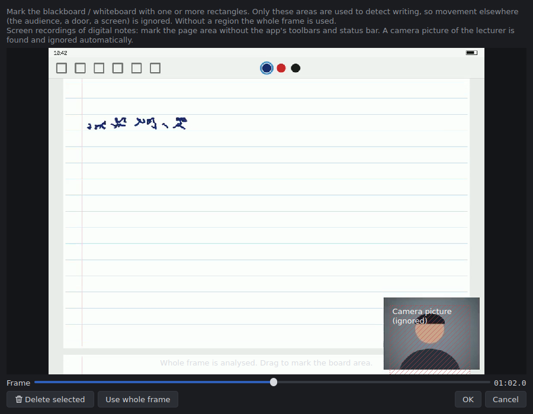

# CutSensei

**Automatic editor for lecture videos** — explanations stay at normal speed, silent board
writing is sped up, idle waiting time is cut.

[日本語 README](README.md) · [How the detection works](docs/ALGORITHM.md) · [Project file format](docs/PROJECT_FORMAT.md) · [Contributing](CONTRIBUTING.md)



CutSensei analyses the audio and video of a lecture recorded with a fixed camera (blackboard,
whiteboard, electronic board) or a screen recording of digital notes (GoodNotes, Notability,
OneNote, ...) and builds an edit automatically. The result is shown in a familiar editor layout (preview in the centre,
timeline at the bottom) where it can be checked, corrected and exported to MP4. It runs on
Windows, macOS and Linux and can use NVIDIA, Intel, AMD and Apple hardware encoders.

## Features

| Part of the lecture | Automatic edit |
|---|---|
| The lecturer is talking | **kept at normal speed** (speech wins even while writing) |
| Silent board writing | **sped up** by a configurable factor (default 4x; audio kept, lowered or muted) |
| Waiting without speech or writing | **removed**, the gap is closed |
| Ambiguous / possibly important | **kept at normal speed and marked for checking** |

- **Chalk and pen noise is not speech**: a bundled neural voice activity detector (Silero VAD) is
  combined with a pitch-based detector. The "tap tap tap" of chalk has no pitch and is not
  mistaken for talking.
- **Walking vs. writing**: CutSensei tracks strokes that *stay* on the board. Walking in front of the
  board is not writing; strokes written behind the lecturer's body are credited to the time they
  were written once they become visible. The board area can be marked on screen (optional, several
  rectangles allowed).
- **Screen recordings of digital notes**: recordings of GoodNotes, Notability, OneNote, whiteboard
  apps or slides written on with a pen are recognised automatically and analysed pixel-exactly.
  Scrolling, page turns, a laser pointer, the mouse cursor, the status bar clock and a webcam
  picture-in-picture of the lecturer are not mistaken for writing
  ([details](#screen-recordings-of-digital-notes)).
- **Never cuts too much**: margins before and after speech, short pauses and breaths are kept, the
  finished board is shown for a moment after writing, short parts are merged so the speed does not
  flicker. Uncertain parts are never deleted automatically.
- **Manual corrections**: split, drag boundaries, delete (gap closes), restore, change speed and
  volume, "always keep" protection, jump through review items and boundaries and play around them.
  Everything is non-destructive with undo/redo.
- **Regenerate without losing work**: when settings change and the automatic edit is re-applied,
  manually edited or protected segments are kept unless explicitly released.
- **Projects** (`.cutsensei`) store the media reference, analysis results, manual edits and settings.
- **Export** to MP4 (H.264/H.265) with resolution, frame rate and quality options (source values by
  default). Audio is time-stretched with preserved pitch and stays sample-accurate in sync.
  Progress and cancel for analysis and export.
- English and Japanese UI, keyboard shortcuts, drag & drop, command line interface for batches.

## Reference scenario

The design goal "60 s explanation + 40 s silent writing + 20 s waiting, writing at 4x → 60 + 10 =
70 s (excluding protective margins)" is verified by the test suite (`tests/test_acceptance.py`) with
a synthetic lecture. With the default margins the result is about 72 s. The same lecture written
in a note app on a tablet and screen-recorded gives the same result (`tests/test_screen.py`).

## Installation

### Pre-built application

Download the archive for your OS from [Releases](https://github.com/philiaxis/CutSensei/releases),
extract it and start `CutSensei` (`CutSensei.exe` on Windows, `CutSensei.app` on macOS). FFmpeg is
included, and so is the command line tool `cutsensei-cli` (on macOS inside
`CutSensei.app/Contents/MacOS/`). On macOS the app is not signed: right-click → *Open* the first time.

### With pip (Python 3.10+)

```bash
pip install git+https://github.com/philiaxis/CutSensei.git
cutsensei            # start the GUI
cutsensei-cli info   # show the detected FFmpeg and GPU encoders
```

From source:

```bash
git clone https://github.com/philiaxis/CutSensei.git
cd CutSensei
python -m venv .venv && source .venv/bin/activate   # Windows: .venv\Scripts\activate
pip install -e ".[dev]"
python -m cutsensei
```

**FFmpeg** is taken from, in order: the path set in Preferences, `CUTSENSEI_FFMPEG`, `ffmpeg` on
`PATH`, and finally the binary bundled with the `imageio-ffmpeg` package (no separate install needed).

### GPU acceleration

- **Encoding**: the encoder "Automatic (GPU if available)" picks NVENC (NVIDIA), Quick Sync (Intel),
  AMF (AMD) or VideoToolbox (Apple) when they work. The FFmpeg bundled for Windows supports NVENC,
  QSV and AMF, so e.g. an RTX 3060 is used without extra setup (a current NVIDIA driver is needed).
  The status bar shows "GPU encoder: NVENC" when it is available.
- **Decoding**: "Use GPU for decoding" (export dialog) and "Use GPU video decoding for analysis"
  (Preferences) enable `-hwaccel auto`; CutSensei falls back to the CPU automatically if it fails.
- On Linux a distribution FFmpeg on `PATH` (with NVENC/VAAPI) is preferred.
- `pip install "cutsensei[gpu]"` runs the speech model with onnxruntime-gpu (the CPU is fast enough).

## Workflow

**Import → (optional) mark the board → adjust settings → Auto edit → review and correct → Export**

1. **Import video** (Ctrl+I) or drop a file on the window - a camera or a screen recording.
2. Optionally mark the blackboard/whiteboard (in a screen recording: the page area) with **Board
   region**.
3. Adjust **board writing speed**, **cut aggressiveness** and **margins around speech** in the
   *Auto edit* panel (more options under *Advanced settings*).
4. Press **Auto edit** (Ctrl+R). Afterwards the original length, edited length, sped-up and deleted
   time and the number of items to check are shown.
5. Review on the timeline: step through items to check (N), play around the playhead (A), restore
   deleted parts from the *Deleted* tab.
6. **Export** (Ctrl+E).

Timeline colours are always accompanied by labels and speeds: green = normal speed, orange = sped up
("Board writing 4x"), red marker = deleted, violet bar = to check; a white corner marks manual edits,
a shield marks protected segments. The timeline shows the *edited length* by default and can switch
to the *original length*. Drag boundaries to adjust them, Ctrl+wheel zooms. In the edited view, pull a
red cut marker sideways to bring back removed material.

### Screen recordings of digital notes

Explanations written on an iPad (GoodNotes, Notability), in OneNote, a whiteboard app or on a PDF
and recorded as a screen recording are supported. On import CutSensei **detects whether the video is
a camera or a screen recording** (shown under *Recording type* in the *Auto edit* panel, where it can
also be chosen by hand) and uses a dedicated analysis for screen recordings:

| On screen | Treated as |
|---|---|
| writing, erasing, adding text or shapes with the pen | board writing (sped up when silent), with exact timing |
| scrolling, zooming, turning pages | part of working on the notes: sped up together with the writing around it when silent; content that was already there is not counted again |
| laser pointer, cursor, pen hover, menus | not writing (changes that vanish within 1.5 s or are undone shortly after); silent pointing for a while is kept at 1x and marked for checking |
| status bar clock, battery and similar indicators | ignored (small changes repeating on their own at the same place) |
| a webcam picture of the lecturer, a playing video | detected as a constantly changing area and ignored (shown in the board region dialog) |
| a still screen without speech | waiting, removed |

Marking the page area without the app's toolbars as the board region makes the analysis even more
robust; a webcam picture that is ignored automatically is shown hatched in that dialog. On an iPad, switch the **microphone on** in the screen recording control; speech is detected
from the audio. Recordings with variable frame rate (iPad screen recordings drop frames while nothing
changes) are handled. A classroom electronic board filmed *with a camera* is analysed like a
blackboard.





### Keyboard

| Key | Action | Key | Action |
|---|---|---|---|
| Space | play / pause | S | split at playhead |
| ← / → | previous / next frame | 1 / 2 / 3 | normal / speed up / delete |
| Shift+← / → | back / forward 1 s | Delete | delete and close the gap |
| ↑ / ↓ | previous / next boundary | R | restore deleted segment |
| N / Shift+N | next / previous item to check | P | always keep (protect) |
| A | play around the playhead | C | mark as checked |
| [ / ] | set segment start / end to playhead | V | edited / original preview |
| + / - / 0 | zoom in / out / fit | Ctrl+A | select all segments |
| Ctrl+Z / Ctrl+Shift+Z | undo / redo | Ctrl+S / Ctrl+O | save / open |
| Ctrl+R | auto edit | Ctrl+E | export |

### Command line

```bash
cutsensei-cli auto lecture.mp4 -o lecture_edited.mp4 --speed 4 --board 0.05,0.08,0.9,0.62 \
    --encoder h264_nvenc
cutsensei-cli analyze lecture.mp4 -o lecture.cutsensei
cutsensei-cli segments lecture.cutsensei
cutsensei-cli export lecture.cutsensei -o lecture_edited.mp4 --height 1080 --quality 2
cutsensei-cli auto goodnotes.mp4 --source screen   # recording type: auto (default), camera, screen
cutsensei-cli demo demo_lecture.mp4     # synthetic 60/40/20 s lecture for testing
cutsensei-cli demo demo_notes.mp4 --scenario screen   # the same as a tablet screen recording
```

`--board` takes fractions of the frame (x, y, width, height between 0 and 1).

## Troubleshooting

- **Linux: the Qt xcb plugin does not load** —
  `sudo apt install libxcb-cursor0 libxkbcommon-x11-0 libegl1 libpulse0`
- **The preview cannot play a file** — analysis and export use FFmpeg directly and still work.
- **No GPU encoder** — check `cutsensei-cli info`, update the GPU driver or choose another FFmpeg in
  Preferences.
- **Detection does not fit your lectures** — mark the board region, lower the aggressiveness or tune
  the thresholds in *Advanced settings*; protect important parts with "always keep".
- **A screen recording is taken for a camera recording (or vice versa)** — choose the right
  *Recording type* in the *Auto edit* panel and press *Re-apply auto edit*.

## Development

```bash
pip install -e ".[dev]"
python -m pytest -q                  # full suite (~1 min, encodes videos)
python -m pytest -q -m "not slow"
python packaging/build.py            # PyInstaller build in dist/
```

## License

MIT. See [THIRD_PARTY_NOTICES.md](THIRD_PARTY_NOTICES.md) for Qt/PySide6, FFmpeg, Silero VAD,
ONNX Runtime, OpenCV and NumPy.
