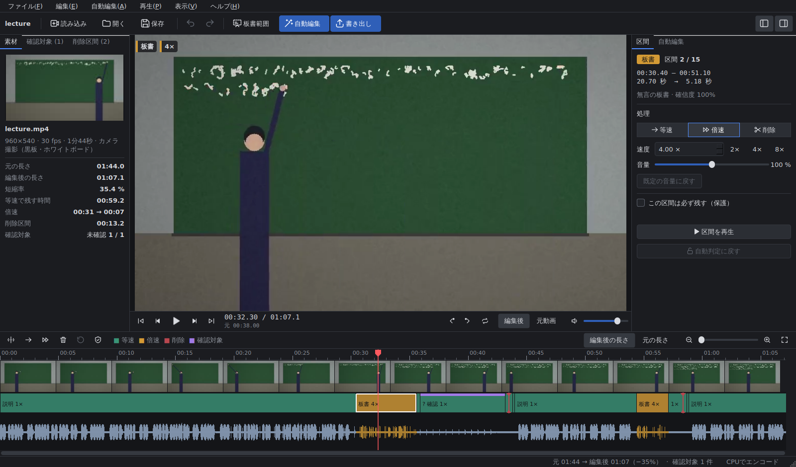
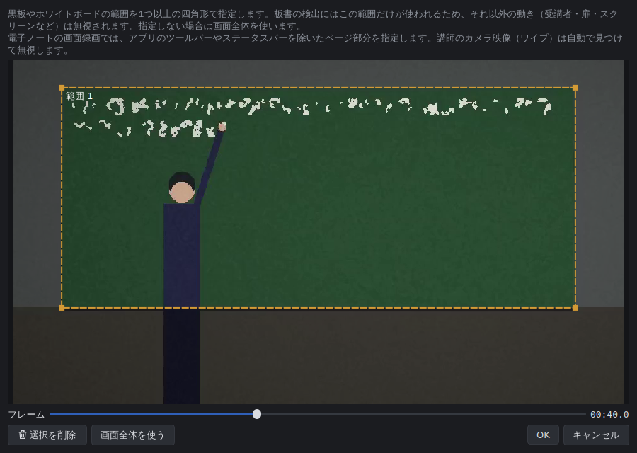

# CutSensei（カットセンセイ）

**講義動画向けの自動編集ソフト** — 説明中は等速、無言で板書している間は倍速、不要な待機はカット。

[English README](README.en.md) ・ [判定アルゴリズムの解説](docs/ALGORITHM.md) ・ [プロジェクトファイルの形式](docs/PROJECT_FORMAT.md) ・ [開発に参加する](CONTRIBUTING.md)



固定カメラで撮影した講義動画を読み込み、音声と映像を解析して編集案を自動で作ります。
一般的な動画編集ソフトに近い画面（中央にプレビュー、下部にタイムライン）で結果を確認・修正し、
そのまま MP4 に書き出せます。Windows・macOS・Linux で動作し、NVIDIA / Intel / AMD / Apple の
GPU エンコードにも対応しています。

## 主な機能

| 区間 | 自動編集の処理 |
|---|---|
| 講師が話している | **等速で残す**（板書しながら話している場合も発話を優先） |
| 話しておらず、板書している | **指定した倍率で倍速**（初期値 4 倍、音声は保持・音量調整・ミュートを選択） |
| 話しておらず、板書もしていない待機 | **削除して前後を隙間なくつなぐ** |
| 判定が曖昧・残す意味がありそう | **等速で残し、確認対象として表示** |

- **チョーク・ペンの音を発話と区別**：ニューラル音声区間検出（Silero VAD、同梱）と、声の周期性（ピッチ）を
  使った信号処理を組み合わせています。「カッカッカ」という打音は周期性がないため発話と判定されません。
- **歩いているだけ／実際に書いている を区別**：黒板上の「消えずに残る線」の増減を追跡します。講師が前を
  横切るだけでは板書と判定されず、講師の体に隠れて書いた文字も、見えた時点で書いた時刻にさかのぼって
  評価します。黒板・ホワイトボードの範囲は画面上で指定できます（複数可、任意）。
- **切りすぎない**：発話前後の保護余白、息継ぎ程度の短い間の保持、書き終えた板書を見せる時間、短い区間の
  統合（等速と倍速が細かく切り替わらない）。不確かな箇所は勝手に削除しません。
- **手動修正**：分割、境界のドラッグ調整、削除（隙間詰め）、復元、速度・音量の変更、「必ず残す」保護、
  確認対象・境界への順次移動と前後再生。すべて非破壊で、元に戻す／やり直すに対応。
- **再生成しても手作業は消えない**：設定を変えて自動編集を再適用しても、手動で修正・保護した区間は
  明示的に解除しない限り上書きされません。
- **プロジェクト保存**：素材の参照、解析結果、手動修正、各設定を `.cutsensei` ファイルに保存して再開できます。
- **書き出し**：MP4（H.264 / H.265）、解像度・フレームレート・画質を指定可能（初期値は元動画のまま）。
  音声はピッチを保ったまま時間伸縮し、映像とサンプル単位で同期します。進捗表示とキャンセルに対応。
- **日本語 / 英語 UI**、キーボード操作、ドラッグ＆ドロップ、コマンドライン版（一括処理向け）。

## 動作の基準例

設計書の基準例「説明 60 秒・無言の板書 40 秒・不要な待機 20 秒の動画を板書 4 倍速で処理すると、
保護余白を除けば 60 + 10 = 70 秒」は自動テスト（`tests/test_acceptance.py`）で毎回検証しています。
実際の解析では、発話末尾の余白（0.4 秒）と「書き終えた板書を見せる時間」（約 1.3 秒）が加わり、約 72 秒になります。

## インストール

### 1. 配布版（おすすめ）

[Releases](https://github.com/philiaxis/CutSensei/releases) から OS に合ったファイルをダウンロードして展開し、
`CutSensei`（Windows は `CutSensei.exe`、macOS は `CutSensei.app`）を起動します。FFmpeg も同梱されています。
同じフォルダーにコマンドライン版の `cutsensei-cli` も入っています（macOS は `CutSensei.app/Contents/MacOS/cutsensei-cli`）。

- **macOS**：署名されていないため、初回は Finder で右クリック →「開く」を選んでください。
- **Linux**：Qt の動作に `libxcb-cursor0` などが必要な場合があります（下記「トラブルシューティング」参照）。

### 2. Python からインストール

Python 3.10 以降が必要です。

```bash
pip install git+https://github.com/philiaxis/CutSensei.git
cutsensei            # GUI を起動
cutsensei-cli info   # FFmpeg・GPU エンコーダーの検出結果を表示
```

ソースから実行する場合：

```bash
git clone https://github.com/philiaxis/CutSensei.git
cd CutSensei
python -m venv .venv
# Windows: .venv\Scripts\activate    macOS/Linux: source .venv/bin/activate
pip install -e ".[dev]"
python -m cutsensei
```

### FFmpeg について

FFmpeg は `imageio-ffmpeg` パッケージに同梱されたものが自動的に使われるため、通常は追加のインストールは不要です。
次の順で探します：環境設定で指定したパス → 環境変数 `CUTSENSEI_FFMPEG` → `PATH` 上の `ffmpeg` → 同梱版。

### GPU の利用（NVIDIA RTX など）

- **書き出し**：「書き出し」→ エンコーダー「自動（使用可能なら GPU）」で、NVENC（NVIDIA）、Quick Sync（Intel）、
  AMF（AMD）、VideoToolbox（Apple）を自動検出して使います。Windows 用の同梱 FFmpeg は NVENC / QSV / AMF に対応
  しているので、**RTX 3060 などでは追加設定なしで GPU エンコードされます**（最新の NVIDIA ドライバーが必要です）。
  ステータスバー右端に「GPUエンコーダー：NVENC」と表示されれば有効です。
- **デコード**：書き出しダイアログの「デコードに GPU を使う」、環境設定の「解析時の映像デコードに GPU を使う」で
  `-hwaccel auto`（CUDA / D3D11VA / VAAPI / VideoToolbox）を使います。失敗した場合は自動的に CPU に戻ります。
- **Linux**：ディストリビューションの FFmpeg（NVENC/VAAPI 対応）が `PATH` にあれば優先して使います。
- 音声解析のモデルを GPU で動かしたい場合は `pip install "cutsensei[gpu]"`（onnxruntime-gpu）。CPU でも十分高速です。

## 使い方

**動画を読み込む → 必要に応じて黒板範囲を指定 → 倍率などを設定 → 自動編集 → プレビューと修正 → 書き出し**

1. **読み込み**（Ctrl+I）で講義動画を開きます。ウィンドウへのドラッグ＆ドロップでも開けます。
2. 必要なら **黒板範囲** で黒板・ホワイトボードを四角形で囲みます（複数可）。受講者やスクリーンの動きを
   板書と誤認しにくくなります。
3. 右パネル「自動編集」で **板書の倍率**・**カットの積極性**・**発話前後の余白** を調整します
   （詳細設定で削除する待機の最短時間なども変更できます）。
4. **自動編集**（Ctrl+R）を押すと解析が始まります（進捗表示・キャンセル可）。完了すると
   「元の長さ」「編集後の長さ」「倍速・削除された時間」「確認対象の数」が表示されます。
5. タイムラインで確認・修正します。確認対象は左パネル「確認対象」から順に移動でき、**N** で次へ、
   **A** で前後を再生できます。削除区間は「削除区間」タブから元の映像を確認して復元できます。
6. **書き出し**（Ctrl+E）で MP4 に保存します。



### タイムラインの見方

- 色とラベルで処理を表示します：**緑＝等速**、**橙＝倍速**（「板書 4×」）、**赤い印＝削除**（編集後表示では
  つながった位置に赤い線で表示）、**上端の紫の帯＝確認対象**。左上の白い三角は手動で修正した区間、盾のアイコンは保護した区間です。
- 通常は **編集後の長さ**（カットと速度を反映）で表示し、ボタンで **元の長さ** 表示に切り替えられます。
- 区間の境界をドラッグで調整、Ctrl+ホイールで拡大縮小、ホイールでスクロール。編集後表示で赤い削除マークを
  左右に引っ張ると、削除された部分を少しずつ戻せます。

### キーボードショートカット

| キー | 操作 | キー | 操作 |
|---|---|---|---|
| Space | 再生 / 停止 | S | 再生位置で分割 |
| ← / → | 1 フレーム戻る / 進む | 1 / 2 / 3 | 等速 / 倍速 / 削除 |
| Shift+← / → | 1 秒戻る / 進む | Delete | 削除して隙間を詰める |
| ↑ / ↓ | 前 / 次の境界 | R | 削除区間を復元 |
| N / Shift+N | 次 / 前の確認対象 | P | 必ず残す（保護） |
| A | 再生位置の前後を再生 | C | 確認済みにする |
| [ / ] | 区間の開始 / 終了を再生位置に合わせる | V | 編集後 / 元動画 の切り替え |
| + / - / 0 | 拡大 / 縮小 / 全体 | Ctrl+A | すべての区間を選択 |
| Ctrl+Z / Ctrl+Shift+Z | 元に戻す / やり直す | Ctrl+S / Ctrl+O | 保存 / 開く |
| Ctrl+R | 自動編集 | Ctrl+E | 書き出し |

### コマンドライン

大量の動画を一括処理する場合に便利です。

```bash
# 解析して書き出しまで一度に（板書 4 倍、黒板範囲を指定、NVENC で書き出し）
cutsensei-cli auto lecture.mp4 -o lecture_edited.mp4 --speed 4 \
    --board 0.05,0.08,0.9,0.62 --encoder h264_nvenc

# 解析だけ行ってプロジェクトを保存 → GUI で確認・修正 → 書き出し
cutsensei-cli analyze lecture.mp4 -o lecture.cutsensei
cutsensei-cli segments lecture.cutsensei
cutsensei-cli export lecture.cutsensei -o lecture_edited.mp4 --height 1080 --quality 2

# 動作確認用の合成講義動画（説明60秒・板書40秒・待機20秒）を作る
cutsensei-cli demo demo_lecture.mp4
```

`--board` は画面に対する割合（x, y, 幅, 高さ、0〜1）です。`cutsensei-cli --help` で全オプションを表示します。

## 設定項目

| 項目 | 説明 | 初期値 |
|---|---|---|
| 板書の倍率 | 無言の板書区間の再生速度 | 4 倍 |
| カットの積極性 | 控えめ（長い待機だけ削除）〜 積極的（短い待機も削除） | 標準（2.9 秒以上の待機を削除） |
| 発話前 / 後の余白 | 発話の頭・末尾が欠けないように残す時間 | 0.25 秒 / 0.40 秒 |
| 倍速区間の音声 | 保持（ピッチ維持）/ 音量を下げる / ミュート | 保持 |
| 削除する待機の最短時間 | これより短い待機は等速で残す | 積極性から自動 |
| 倍速にする板書の最短時間 | これより短い板書は等速のまま（切り替えの多発を防止） | 積極性から自動 |
| 発話中 / 板書中の間をつなぐ長さ | 短い間を同じ区間として扱う | 積極性から自動 |
| 板書後に残す時間 | 書き終えた板書を見せる時間 | 積極性から自動 |
| カット前後の余白 | 削除区間の前後に残す時間 | 積極性から自動 |
| 発話 / 板書判定のしきい値、確認対象にする幅 | 判定の感度と「曖昧」とみなす範囲 | 積極性から自動 |
| 発話検出 | 自動（ニューラル＋信号処理）/ ニューラル / 信号処理 | 自動 |

## プロジェクトファイル

`.cutsensei` は JSON 形式で、素材の絶対パスと相対パス、解析結果（圧縮済み）、区間のリスト（手動修正・保護を含む）、
黒板範囲、自動編集・書き出しの設定を保存します。素材を移動した場合は、プロジェクトと同じフォルダーにあれば
自動で見つけ、見つからなければ場所を尋ねます。元の動画ファイルは一切変更しません。

## トラブルシューティング

- **Linux で起動しない（xcb プラグインのエラー）**：
  `sudo apt install libxcb-cursor0 libxkbcommon-x11-0 libegl1 libpulse0`
- **プレビューが再生できない**：プレビューには Qt Multimedia（FFmpeg バックエンド）を使っています。
  特殊なコーデックの場合でも、解析と書き出しは FFmpeg 本体で行うため可能です。
- **GPU エンコーダーが表示されない**：`cutsensei-cli info` で検出結果を確認してください。NVENC にはドライバーの
  更新が必要な場合があります。別の FFmpeg を使う場合は環境設定で指定します。
- **判定が合わない**：黒板範囲を指定する、カットの積極性を下げる、詳細設定でしきい値を調整する、などを
  試してください。確認対象を順に見て、必要な区間は「必ず残す」で保護できます。

## 開発

```bash
pip install -e ".[dev]"
python -m pytest -q                 # 全テスト（動画の生成・書き出しを含む、約1分）
python -m pytest -q -m "not slow"   # 速いテストのみ
python packaging/build.py           # PyInstaller で配布版を作成（dist/）
python tools/make_screenshots.py docs/images --lang ja
```

構成：`src/cutsensei/core`（区間モデル・プロジェクト・FFmpeg 連携）、`analysis`（音声・映像解析と判定）、
`render`（書き出し）、`ui`（PySide6 の画面）、`cli.py`（コマンドライン）。詳しくは [CONTRIBUTING.md](CONTRIBUTING.md)。

## ライセンス

MIT License。同梱・利用しているソフトウェア（Qt/PySide6、FFmpeg、Silero VAD、ONNX Runtime、OpenCV、NumPy）の
ライセンスは [THIRD_PARTY_NOTICES.md](THIRD_PARTY_NOTICES.md) を参照してください。
